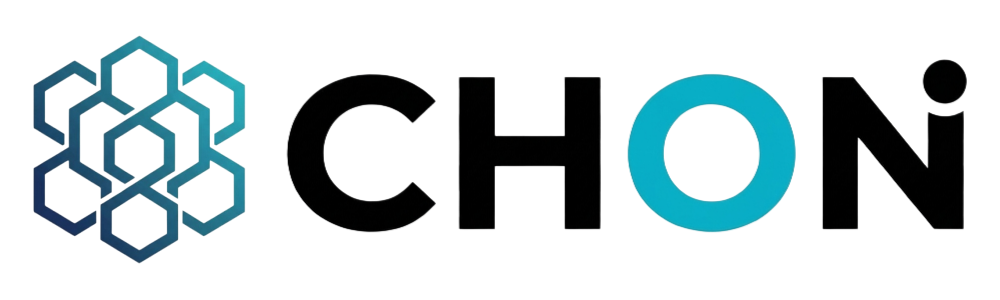

# CHON - Relationship is Identity



## 📱 프로젝트 소개

CHON은 인간 관계를 핵심으로 하는 차세대 탈중앙화 신원 인증 플랫폼(DID, Decentralized Identity)입니다. 메타버스 시대를 위한 새로운 신원 인프라를 구축하여 **"관계가 곧 신원이다"** 라는 철학을 실현합니다.

## 🌟 핵심 가치

- **관계 기반 신원 증명**: 가족, 친구, 동료와의 관계를 통한 진정한 신원 증명
- **Web of Trust**: 지인과 가족의 증명을 통한 관계 기반 신뢰 네트워크
- **영지식 증명(ZKP)**: 민감정보를 노출하지 않고 신원 검증
- **탈중앙화 구조**: 중앙 기관 없이 개인 간 신뢰를 쌓아가는 분산 신원

## 🏗️ 프로젝트 구조

```
chon-home/
├── index.html              # 홈페이지
├── about.html              # 회사 소개
├── technology.html         # 기술 소개  
├── service.html            # 서비스 소개
├── ceo.html                # CEO 메시지
├── news.html               # 뉴스
├── contact.html            # 문의
├── ir.html                 # 투자 정보
├── privacy-policy.html     # 개인정보 정책
├── css/                    # 스타일시트
│   ├── variables.css       # CSS 변수 (색상, 폰트, 크기)
│   ├── base.css            # 기본 스타일
│   ├── navbar.css          # 네비게이션
│   ├── buttons.css         # 버튼 스타일
│   ├── footer.css          # 푸터
│   ├── style.css           # 메인 스타일
│   └── pages.css           # 페이지 전용 스타일
├── js/                     # JavaScript 모듈
│   ├── utils.js            # 유틸리티 함수
│   ├── navbar.js           # 네비게이션 기능
│   ├── hero.js             # 히어로 슬라이더
│   ├── animations.js       # 애니메이션
│   ├── interactions.js      # 상호작용
│   └── index.js            # 메인 스크립트
├── images/                 # 이미지 자산
├── package.json            # 프로젝트 메타데이터
└── README.md               # 이 파일
```

## 🎨 기술 스택

- **Frontend**: HTML5, CSS3, JavaScript (ES6+)
- **Design**: 반응형 웹 디자인, CSS Grid, Flexbox
- **Icons**: Font Awesome 6.4.0
- **Fonts**: Google Fonts (Noto Sans KR, Inter)
- **Architecture**: 모듈화된 CSS 및 JavaScript 구조

## 📄 페이지 구성

| 페이지 | 설명 |
|-------|------|
| `index.html` | 메인 페이지 - 히어로, 뉴스, 서비스 소개 |
| `about.html` | 회사 소개 - 비전, 미션, 가치 |
| `technology.html` | 기술 설명 - DID 기술, 아키텍처 |
| `service.html` | 서비스 소개 - Smart Genealogy |
| `ceo.html` | CEO 메시지 및 인터뷰 |
| `news.html` | 뉴스 및 보도자료 |
| `contact.html` | 문의 및 피드백 |
| `ir.html` | 투자자 정보 |
| `privacy-policy.html` | 개인정보 처리방침 |

## 🚀 시작하기

### 1. 로컬 환경 설정

프로젝트 클론 및 디렉토리 이동:
```bash
git clone [repository-url]
cd chon-home
```

### 2. 웹서버 실행

간단한 HTTP 서버 실행:
```bash
# Python 3.x 사용 시
python -m http.server 8000

# Node.js 사용 시
npx http-server

# 또는 VSCode Live Server 확장 사용
```

### 3. 브라우저에서 확인

```
http://localhost:8000
```

## 📱 반응형 디자인

- **Desktop**: 1200px 이상
- **Tablet**: 768px - 1199px
- **Mobile**: 640px 이하
- **Extra Small**: 480px 이하

## 🌐 SEO 최적화

- 의미있는 HTML 마크업
- Open Graph 메타 태그
- Schema.org 구조화된 데이터
- 접근성(Accessibility) 준수

## 🔧 개발 가이드

### CSS 구조
- `variables.css`: 색상, 폰트, 크기 변수 정의
- `base.css`: 전역 기본 스타일
- `style.css`: 메인 레이아웃 및 컴포넌트
- `pages.css`: 개별 페이지 맞춤 스타일

### JavaScript 모듈
- `utils.js`: 공통 유틸리티 함수
- `navbar.js`: 네비게이션 상호작용
- `hero.js`: 히어로 슬라이더 제어
- `animations.js`: 스크롤 애니메이션
- `interactions.js`: 사용자 상호작용

## 📊 페이지 성능

- 최소화된 CSS 및 JavaScript
- 지연 로딩(Lazy Loading) 이미지
- 효율적인 CSS Grid 레이아웃
- 부드러운 애니메이션 및 트랜지션

## 📞 문의 및 지원

- **Website**: [chon.com](https://chon.com)
- **Email**: ops@chon.ai
- **Address**: 서울특별시 강남구 강남대로464 3층 309호

## 📄 라이선스

MIT License - 자유롭게 사용, 수정, 배포 가능

## 👥 기여

개선 사항이나 버그 신고는 이슈 등록 후 PR을 통해 기여해주시길 바랍니다.

---

**Last Updated**: 2026년 2월 6일
- **Fonts**: Inter, Noto Sans KR
- **Features**: 
  - 히어로 슬라이더 (자동 재생)
  - 언어 전환 (한국어/영어)
  - 반응형 네비게이션
  - 성능 최적화
  - 접근성 개선

## 📱 페이지 구성

- **메인 페이지** (`index.html`) - 히어로 섹션, 뉴스, 비전, 서비스 소개
- **회사 소개** (`about.html`) - 회사 정보 및 비전
- **기술 소개** (`technology.html`) - CHON DID 기술 설명
- **서비스** (`service.html`) - Smart Genealogy 서비스
- **뉴스** (`news.html`) - 언론 보도 및 최신 소식
- **투자 정보** (`ir.html`) - 투자자를 위한 정보
- **연락처** (`contact.html`) - 문의 및 연락처 정보
- **CEO 소개** (`ceo.html`) - 대표이사 소개
- **개인정보처리방침** (`privacy-policy.html`)

## 🎨 디자인 시스템

### 컬러 팔레트
- **Primary**: #1a1a2e (다크 네이비)
- **Secondary**: #16213e (미드나잇 블루)
- **Accent**: #0f3460 (딥 블루)
- **Highlight**: #e94560 (코랄 레드)
- **Success**: #00d4aa (민트 그린)

### 그라디언트
- **Primary**: linear-gradient(135deg, #667eea 0%, #764ba2 100%)
- **Hero**: linear-gradient(135deg, #1a1a2e 0%, #16213e 50%, #0f3460 100%)

## 📦 파일 구조

```
chon/
├── css/
│   ├── style.css          # 메인 스타일시트
│   └── pages.css          # 페이지별 스타일
├── js/
│   └── main.js            # JavaScript 기능
├── images/
│   ├── chon-logo.png      # 메인 로고
│   ├── chon-logo-new.png  # 푸터 로고
│   ├── family-tree-hero.png
│   └── chon-app-screen*.png
├── index.html             # 메인 페이지
├── about.html             # 회사 소개
├── technology.html        # 기술 소개
├── service.html           # 서비스 소개
├── news.html              # 뉴스 페이지
├── ir.html                # 투자 정보
├── contact.html           # 연락처
├── ceo.html               # CEO 소개
└── privacy-policy.html    # 개인정보처리방침
```

## 🌐 반응형 디자인

- **Desktop**: 1200px 이상
- **Tablet**: 768px - 1199px
- **Mobile**: 767px 이하

모든 페이지가 다양한 디바이스에서 최적화되어 표시됩니다.

## ✨ 주요 기능

### 히어로 슬라이더
- 자동 재생 (2초 간격)
- 마우스 호버 시 일시정지
- 네비게이션 도트 클릭으로 수동 제어

### 언어 전환
- 한국어/영어 지원
- 로컬 스토리지에 언어 설정 저장
- 전체 페이지 콘텐츠 번역

### 뉴스 시스템
- 실제 언론 보도 내용
- 텍스트 전용 깔끔한 디자인
- 뉴스레터 구독 기능

## 🏢 회사 정보

- **회사명**: CHON
- **대표이사**: 신근영 
- **정보보안담당자**: 김남율 
- **이메일**: ops@chon.ai
- **주소**: 서울특별시 강남구 강남대로464 3층 309호
- **사업자등록번호**: 110111-9136890

## 🚀 배포 방법

### 1. 정적 호스팅
- GitHub Pages
- Netlify
- Vercel
- AWS S3 + CloudFront

### 2. 로컬 개발
```bash
# 간단한 HTTP 서버 실행
python -m http.server 8000
# 또는
npx serve .
```

## 📈 성능 최적화

- CSS 변수 시스템으로 일관된 디자인
- GPU 가속 애니메이션
- 이미지 lazy loading
- 최적화된 폰트 로딩
- 접근성 개선 (ARIA 라벨, 키보드 네비게이션)

## 🔧 브라우저 지원

- Chrome 90+
- Firefox 88+
- Safari 14+
- Edge 90+

## 📄 라이선스

© 2026 CHON. All rights reserved.

## 📞 문의

프로젝트에 대한 문의사항이 있으시면 ops@chon.ai로 연락해 주세요.

---

**"Relationship is Identity | 관계가 곧 신원이다"**