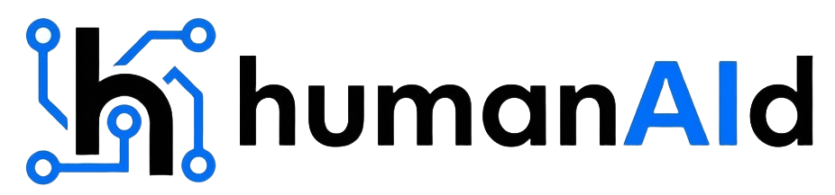

# HumanAID - Human + AI + Digital Solutions



## 🌟 프로젝트 소개

**HumanAID**는 AI, 휴먼, 디지털을 결합한 혁신적인 솔루션 기업의 공식 웹사이트입니다. 헬스케어 AI, 탈중앙화 신원인증(DID), 스마트팜 분야에서 End-to-End AI 플랫폼을 제공합니다.

**핵심 플랫폼**: Make.IT_AI-Assistant - 데이터 수집부터 모델 운영(MLOps)까지 전 과정을 지원하는 통합 AI 분석 플랫폼

## 🎯 핵심 사업 분야

### 1. 헬스케어 AI
- 의료영상 분석 (CT/MRI/X-ray)
- 임상 의사결정 지원
- 운영 최적화 및 예측 분석

### 2. DID (탈중앙화 신원인증)
- 블록체인 기반 신원 증명
- 개인정보 주권 실현
- 병원/임상시험/스마트시티 인증

### 3. 스마트팜 AI (Coming Soon)
- IoT 기반 환경 데이터 수집
- 생육 최적화 및 병해충 예측
- 자율 제어 시스템

## 🏗️ 프로젝트 구조

```
humanaid-home/
├── index.html              # 메인 페이지
├── about.html              # 회사 소개
├── technology.html         # 기술 소개
├── service.html            # 서비스 소개
├── ceo.html                # CEO 메시지
├── news.html               # 뉴스 및 보도자료
├── contact.html            # 문의 페이지
├── ir.html                 # 투자 정보
├── privacy-policy.html     # 개인정보 처리방침
├── css/                    # 스타일시트
│   ├── variables.css       # CSS 변수 (색상, 폰트)
│   ├── base.css            # 기본 스타일
│   ├── navbar.css          # 네비게이션
│   ├── buttons.css         # 버튼 스타일
│   ├── footer.css          # 푸터
│   ├── style.css           # 메인 스타일
│   └── pages.css           # 페이지별 스타일
├── js/                     # JavaScript 모듈
│   ├── utils.js            # 유틸리티 함수
│   ├── navbar.js           # 네비게이션 기능
│   ├── hero.js             # 히어로 슬라이더
│   ├── animations.js       # 스크롤 애니메이션
│   ├── interactions.js     # 사용자 상호작용
│   └── https-redirect.js   # HTTPS 리다이렉트
└── images/                 # 이미지 및 미디어 파일
```

## 🎨 기술 스택

- **Frontend**: HTML5, CSS3, JavaScript (ES6+ Modules)
- **Design**: 반응형 웹 디자인, CSS Grid, Flexbox
- **Icons**: Font Awesome 6.4.0
- **Fonts**: Noto Sans KR, Inter (Google Fonts)
- **Architecture**: 모듈화된 CSS 및 JavaScript 구조

## ✨ 주요 기능

### 히어로 슬라이더
- 자동 재생 슬라이더
- 브랜드 무비 비디오 재생
- 플랫폼 아키텍처 시각화

### 언어 전환
- 한국어/영어 지원
- 로컬 스토리지 기반 언어 설정 저장
- 실시간 콘텐츠 전환

### 반응형 디자인
- Desktop: 1200px 이상
- Tablet: 768px - 1199px
- Mobile: 767px 이하

### 접근성
- ARIA 라벨 및 역할 지정
- 키보드 네비게이션 지원
- 시맨틱 HTML 마크업

## 🚀 시작하기

### 로컬 개발 환경

1. 저장소 클론
```bash
git clone https://github.com/hobbong21/humanaid-home.git
cd humanaid-home
```

2. 로컬 서버 실행
```bash
# Python 3.x
python -m http.server 8000

# Node.js
npx http-server

# VSCode Live Server 확장 사용 권장
```

3. 브라우저에서 확인
```
http://localhost:8000
```

## 📱 페이지 구성

| 페이지 | 파일명 | 설명 |
|-------|--------|------|
| 메인 | `index.html` | 히어로, 뉴스, 비전, 서비스 소개 |
| 회사 소개 | `about.html` | 비전, 미션, 가치 |
| 기술 | `technology.html` | DID 기술, AI 솔루션 |
| 서비스 | `service.html` | Human DID, Make.IT, 스마트팜 |
| CEO | `ceo.html` | CEO 메시지 및 인터뷰 |
| 뉴스 | `news.html` | 보도자료 및 최신 소식 |
| 투자 정보 | `ir.html` | 투자자 정보 및 문의 |
| 문의 | `contact.html` | 문의 양식 및 FAQ |
| 개인정보 | `privacy-policy.html` | 개인정보 처리방침 |

## 🎨 디자인 시스템

### 색상 팔레트
```css
--primary-color: #1a1a2e;      /* 다크 네이비 */
--secondary-color: #16213e;    /* 미드나잇 블루 */
--accent-color: #0f3460;       /* 딥 블루 */
--highlight-color: #e94560;    /* 코랄 레드 */
--success-color: #00d4aa;      /* 민트 그린 */
```

### 타이포그래피
- **한글**: Noto Sans KR (300, 400, 500, 600, 700)
- **영문**: Inter (300, 400, 500, 600, 700, 800)

## 🔧 개발 가이드

### CSS 모듈 구조
- `variables.css`: 전역 CSS 변수 정의
- `base.css`: 기본 스타일 및 리셋
- `navbar.css`: 네비게이션 컴포넌트
- `buttons.css`: 버튼 스타일
- `footer.css`: 푸터 컴포넌트
- `style.css`: 메인 레이아웃 및 섹션
- `pages.css`: 개별 페이지 스타일

### JavaScript 모듈
- `utils.js`: 공통 유틸리티 함수
- `navbar.js`: 네비게이션 상호작용
- `hero.js`: 히어로 슬라이더 제어
- `animations.js`: 스크롤 애니메이션
- `interactions.js`: 사용자 상호작용

## 📊 성능 최적화

- CSS 변수 시스템으로 일관된 디자인
- 모듈화된 JavaScript (ES6 Modules)
- 이미지 lazy loading
- 최적화된 폰트 로딩
- GPU 가속 애니메이션

## 🌐 SEO 최적화

- 시맨틱 HTML5 마크업
- Open Graph 메타 태그
- Schema.org 구조화된 데이터
- 의미있는 alt 텍스트
- 접근성 준수 (ARIA)

## 🔒 보안

- HTTPS 자동 리다이렉트
- Content Security Policy
- XSS 방지
- 안전한 외부 링크 (rel="noopener noreferrer")

## 🌍 브라우저 지원

- Chrome 90+
- Firefox 88+
- Safari 14+
- Edge 90+
- 모바일 브라우저 (iOS Safari, Chrome Mobile)

## 📈 배포

### Netlify
- `netlify.toml` 설정 파일 포함
- 자동 배포 지원

### Vercel
- `vercel.json` 설정 파일 포함
- Git 연동 자동 배포

## AI 상담봇 연동

AI 상담봇은 서버리스 API를 통해 OpenAI를 호출합니다.

- Vercel: `api/ai-chat.js`
- Netlify: `netlify/functions/ai-chat.js` + `netlify.toml` 리라이트(`/api/ai-chat`)

필수 환경변수:

```bash
OPENAI_API_KEY=your_openai_api_key
OPENAI_MODEL=gpt-4o-mini
AI_RATE_LIMIT_MAX=10
AI_RATE_LIMIT_WINDOW_MS=60000
```

`OPENAI_MODEL`은 선택이며, 미설정 시 기본값 `gpt-4o-mini`를 사용합니다.
`AI_RATE_LIMIT_MAX`, `AI_RATE_LIMIT_WINDOW_MS`도 선택값이며 기본값은 각각 `10`, `60000`(1분)입니다.

### GitHub Pages
```bash
# gh-pages 브랜치로 배포
git subtree push --prefix . origin gh-pages
```

## 🏢 회사 정보

- **회사명**: HumanAID
- **대표이사**: 송기영
- **이메일**: contact@humanaid.digital
- **웹사이트**: https://humanaid.digital
- **사업자등록번호**: 104-81-26688

## 📞 문의

- **파트너십 문의**: contact@humanaid.digital
- **투자 문의**: ir@humanaid.digital
- **기술 지원**: support@humanaid.digital

## 📄 라이선스

© 2026 HumanAID. All rights reserved.

## 🤝 기여

이 프로젝트는 HumanAID의 공식 웹사이트입니다. 개선 사항이나 버그 신고는 이슈를 통해 제출해 주세요.

---

**Last Updated**: 2026년 3월 3일

**Version**: 2.0.0

**Status**: Production
